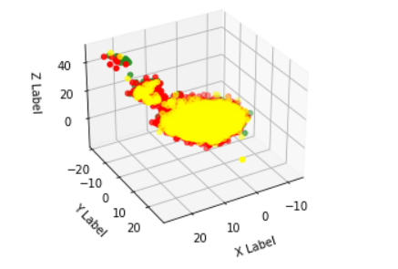
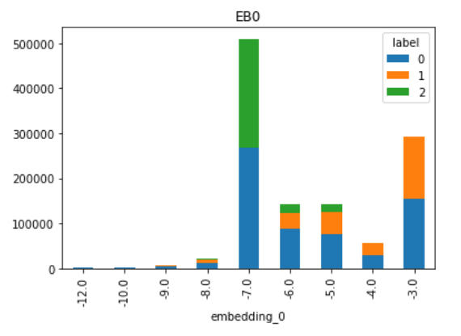
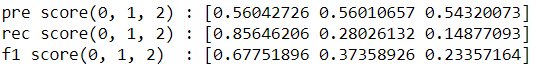
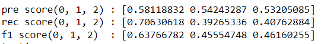

# 簡介
- 一些測試、觀察放在 data_testing.ipynb
- 最後確定的訓練、處理結果放在 model.ipynb

---
## 心得 : 
- 資料維度不算小，首先使用Pandas讀取後使用`.info()`觀察是否有缺項、資料類型
- 而後透過 `sns` 觀察label的分布，發現0大概是1、2的兩倍
- 透過KS-test觀察 train、test，可以發現兩份資料基本上`屬於同個分布`
- 正規化後透過基本的降維嘗試(PCA、actorAnalysis)觀察分布，可以發現沒有明顯區隔
    
---
## 預處理 : 
1. 透過模型直接初篩 - 怎麼起步
- 因資料沒有缺失值，且從`.describe()`看可以發現，大多training的特徵值像是高斯分布的亂數資料
- 特徵值挑選先觀察模型結果，首先直接使用RF訓練，會發現testing accraucy落在約 55% 與training 差異不大
- 從模型的 feature important 可以發現，樹在切分決定時大量採用 feature 24
- 觀察24發現，可以透過是否大於24的平均值，分出1、2
- 使用 LDA 發現，即便在只有0、1 或 0、2的情況，資料沒辦法找出好的切分向量
2. 特徵工程 - 怎麼處理
- 先固定 24大於平均值，(大多為0、1的情況)，再次進行訓練，取出feature important
- 將 feature important > 0.03(區分0、1而言相對重要的特徵)取出，其餘drop，透過plot觀察 label 分布
- 根據上述幾項feature，在有差異的項次做出 feature (e.g feature 49 over 0.5 = 1)
- 將上面產生的feature做cross，產生出帶交集訊息的特徵
- 因 binary的資料很多會有訓練上的overfitting、curse of dimensionality，所以做 feature embedding
  
---
## 模型 
訓練數據最終為 RF篩選重要度>0.03的特徵，加上上述生產出來的embedding資料
1. 選用考量 - 為什麼用RF
- 考量點從 資料性質、資料大小、`訓練時間`決定
- RF 以 bagging的方式訓練樹，可以給出概觀而言的資料用處，且訓練時間也相對友善
- 從資料觀察發現，資料基本上不會是時序資料，偏向獨立的隨機亂數，所以不會使用CNN、RNN、LSTM等模型
- label 是category的資料，所以不使用回歸模型
- SVM 模型雖然適用於高維的category資料，但資料很大時SVM的訓練時間會非常恐怖
2. 訓練進程
- 因資料本身不會到很不平衡，所以綜合指標採用accuracy觀察
- 因差異很小，所以固定 seed 確保模型訓練結果相同
- accuracy 55.2 % : 所有資料未處理 
- accyracy 55.6 % : 增加第一個 Feature 根據 24 > mean 做出0，1、將importance < 0.03 的特徵移除
- accyracy 55.9 % : 將特徵工程做出的 embedding 加入

---
## 訓練結果、驗證結果
1. RF classifier
- 透過 KFold 訓練同時驗證結果，可以發現整份資料本身並沒有因在不同段，有大的差異性
- 最終結果 accuracy 為 55.9%
- 其中 Precision、Recall、F1 分數如下圖

    

2. XGB classifier
- 同樣透過 KFold驗證訓練結果
- 最終結果 accuracy 為 56.6%
- Precision、Recall、F1 分數如下圖

   
3. 結果探討 :
- XBG的結果(accuracy)比RF要好，不過從F1可以看出，是透過下降 0的部分，提高1、2的precision與recall
- 原因推測，雖然資料隨機的數據組合起來，不過其中有些特徵並非完全平均分布，所以交集的資料可以提高對1、2的區分度
- RF 純粹透過bagging的形式切分樹，(資料平衡時樹的區別很小)，當特徵的不平衡性很小，模型會純粹依照最小 loss的形式切分，所以會`偏向預測更多的 0，因為資料中0佔的比例要更多`
- XGB 因為有加入boosting的概念，所以每顆樹的會根據上次預測結果調整資料權重，所以若有些微的資料可以透過特徵分出，便可以提高對該資料的識別度。
- 因此假設資料真的是隨機分布產生的特徵，並且資料量更大，XGB樹增加，那 XGB 與 RF 的訓練差異應該會更小，因boosting產生的樹差，最終經過投票仍會由原本資料的比例與分布影響